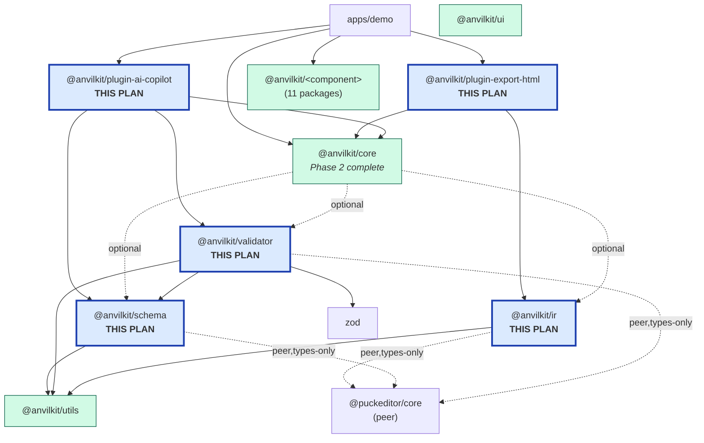
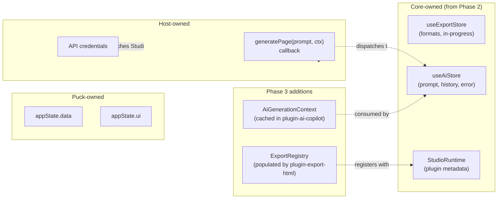

# Phase 3 — Export & AI Pipeline Development Plan

**Created:** 2026-04-11
**Target phase:** [Phase 3 — Export & AI Pipeline (October–December 2026)](./project-roadmap.md#phase-3-export--ai-pipeline-octoberdecember-2026)
**Derived from:** [`docs/ai-context/anvilkit-architecture.md`](../ai-context/anvilkit-architecture.md) §7, §8, §12, §13, §15
**Builds on:** [`docs/plans/core-development-plan.md`](./core-development-plan.md) — Phase 2 is complete, see [completion audit](../code-review/core-development-plan-completion-audit.md).
**Task index:** [`docs/tasks/`](../tasks/) (`phase3-001` … `phase3-015`)
**Reference implementation:** [`ancyloce/anvilkit-puck-studio`](https://github.com/ancyloce/anvilkit-puck-studio) (prior art for IR/HTML exporter)
**Status:** Shipped
**Shipped:** 2026-04-14 — see [phase3-015 quality gates + release readiness](../tasks/phase3-015-quality-gates-release.md) and its [review report](../code-review/phase3/phase3-015-review.md).

---

## 1. Context

Phase 2 shipped `@anvilkit/core` — the Studio runtime, the `<Studio>` React shell, the plugin lifecycle engine, and the full type surface for plugins, exports, IR, AI, and config. Phase 2 deliberately stopped at **types and contract**: `PageIR`, `ExportFormatDefinition`, `AiComponentSchema`, `AiGenerationContext`, and `AiValidationResult` all live in `packages/core/src/types/` but nothing in the repo actually produces or consumes them. That is the gap Phase 3 closes.

Phase 3 is the **proof of value** for the Studio platform. When it ships, a user sitting in `apps/demo/app/puck/editor/page.tsx` will be able to (1) click an "Export HTML" button and get a deterministic, asset-inlined HTML file, and (2) type a prompt into an AI copilot panel and watch a validated `PageIR` land in the canvas as new blocks. Neither of these is possible today because the transformation, validation, serialization, and plugin layers all still need to be built.

Phase 3 exists to:

- **Build the headless IR layer** (`@anvilkit/ir`) so every export format consumes the same normalized input, and so round-tripping is provable via snapshot tests.
- **Build the AI schema extraction layer** (`@anvilkit/schema`) so LLM prompts are generated automatically from the user's Puck `Config` rather than hand-maintained per-component.
- **Build the validator layer** (`@anvilkit/validator`) so LLM output cannot corrupt the editor state — every injected `PageIR` must pass a runtime Zod check before `setData` fires.
- **Ship the first concrete format plugin** (`@anvilkit/plugin-export-html`) so Core's `ExportFormatDefinition` contract has a real consumer, not just tests.
- **Ship the first concrete AI plugin** (`@anvilkit/plugin-ai-copilot`) so the `StudioPluginContext.puckApi.dispatch` + `generatePage()` trust model is proven in practice.
- **Prove the pipeline end-to-end** via Playwright — edit a page, export it, render the export, assert it matches.

**MVP boundary.** Phase 3 is in scope for Q4 2026 per the project roadmap. What is **not** in scope for Phase 3: a React-source exporter (Phase 5), asset CDN integration (Phase 5), version history (Phase 5), a plugin marketplace (Phase 5), Core API churn (frozen for `0.1.x` alpha per `core-development-plan.md` §8), or wiring `@anvilkit/button` / `@anvilkit/input` into the demo (separate Phase 0 hygiene task).

---

## 2. Scope

### In scope

- `@anvilkit/ir` package: `puckDataToIR()`, `irToPuckData()`, `collectAssets()`, `identifySlots()`, + round-trip + snapshot fixtures for all 9 demo components.
- `@anvilkit/schema` package: `extractFieldSchema()`, `configToAiContext()`, `identifySlotFields()`, `isJsonSerializable()`, + snapshot tests for emitted `AiGenerationContext` of every demo component.
- `@anvilkit/validator` package: `validateComponentConfig()` (checks a Puck `Config` is export-ready) and `validateAiOutput()` (validates an LLM `PageIR` response using Zod schemas derived from `AiComponentSchema[]`).
- `@anvilkit/plugin-export-html` (git submodule at `packages/plugins/plugin-export-html/`): a `StudioPlugin` that contributes an `ExportFormatDefinition` with `id: "html"`, running `PageIR → HTML + CSS` with asset inlining.
- `@anvilkit/plugin-ai-copilot` (git submodule at `packages/plugins/plugin-ai-copilot/`): a `StudioPlugin` factory `createAiCopilotPlugin({ generatePage })` that derives schemas, calls the host's `generatePage()`, validates the response, and dispatches `setData` with the resulting Puck data.
- AI mock harness inside the ai-copilot package: fixture prompts + expected `PageIR` outputs + contract tests that assert the validator agrees.
- Playwright E2E test in `apps/demo`: drive the editor, trigger HTML export, assert the downloaded content matches the rendered page.
- Demo integration: wire `createHtmlExportPlugin()` and `createAiCopilotPlugin()` into `apps/demo/app/puck/editor/page.tsx` alongside the existing `smokeTestPlugin`.
- CI quality gates for all new packages: `publint`, `madge --circular`, `check:react-free-runtime` (ir/schema/validator only), `check:peer-deps`, and a fresh IR/HTML snapshot gate.

### Out of scope

- React-source exporter, JSON exporter, PDF exporter — Phase 5.
- CLI tools (`anvilkit export`, `anvilkit validate`) — Phase 5.
- Real LLM integration in CI — the AI plugin takes a `generatePage()` callback; CI uses the mock harness. Host apps wire a real provider.
- Asset CDN, image optimization, media upload — Phase 5.
- Plugin marketplace, template library — Phase 5.
- Changes to `@anvilkit/core` public API — Core is frozen for `0.1.x`; any gap discovered during Phase 3 gets recorded as a Phase 4 follow-up, not back-patched.
- Deciding Open Architectural Decision #1 (submodule strategy) or #2 (plugin topology) — this plan notes them but does not resolve them; Phase 3 proceeds with the current submodule layout.

---

## 3. Prerequisites

Phase 3 inherits almost everything it needs from Phase 2:

| Prerequisite | Delivered by | Confidence |
|---|---|---|
| Vitest + RTL in root workspace | `core-001` | **Done** (21 test files in core, green) |
| `@anvilkit/utils` zero-dep leaf | `core-002` | **Done** (`deepMerge`, `generateId`, `invariant`, `debounce`, `getStrictContext`) |
| Zod ^4.3 + Zustand ^5.0 adopted | `core-003` | **Done** (root + core `package.json`) |
| `@anvilkit/core` type surface frozen | `core-005`, `core-006`, `core-007` | **Done** (`api-snapshot.json` committed) |
| `StudioPlugin` runtime + `compilePlugins()` | `core-008` | **Done** |
| `<Studio>` shell + demo proof of value | `core-014`, `core-016` | **Done** (demo builds, smoke plugin lifecycle green) |
| Changesets `fixed: [["@anvilkit/core"]]` | `core-003` | **Done** |

**The one new prerequisite Phase 3 adds:**

| Prerequisite | Tracked as | Rationale |
|---|---|---|
| Playwright + `apps/demo` E2E harness | [`phase3-001`](../tasks/phase3-001-playwright-setup.md) | The plan's end-to-end acceptance gate (§8 R3) is a Playwright run that exports a page and asserts the HTML output matches the rendered page. Without Playwright, the HTML exporter plugin has no integration test at all. |

---

## 4. Architecture Overview

### 4.1 Dependency graph

Phase 3 adds three headless packages below `@anvilkit/core` (`ir`, `schema`, `validator`) and two plugin packages above it (`plugin-export-html`, `plugin-ai-copilot`). The arrow direction is "depends on". This matches the architecture doc §8 target diagram.



**Forbidden edges (enforced by `madge --circular` + custom workspace lint):**

- `@anvilkit/ir` must **not** import `@anvilkit/schema`, `@anvilkit/validator`, `@anvilkit/core`, `@anvilkit/plugins`, or React (architecture §8 L481).
- `@anvilkit/schema` must **not** import `@anvilkit/ir`, `@anvilkit/validator`, `@anvilkit/core`, `@anvilkit/plugins`, or React (architecture §8 L449).
- `@anvilkit/validator` must **not** import `@anvilkit/ir`, `@anvilkit/core`, `@anvilkit/plugins`, or React (architecture §8 L465).
- Plugin packages must **not** import each other.
- No package imports `apps/*`.

### 4.2 Package internals

Three new headless packages plus two plugin packages. Each package follows the same `src/` convention as `@anvilkit/core`: a thin `index.ts` barrel, subdirectories by concern, and a sibling `__tests__/` or `*.test.ts` for every public function.

```text
packages/ir/
├── package.json              # peerDeps: @puckeditor/core; deps: @anvilkit/utils
├── tsconfig.json             # extends @anvilkit/typescript-config/base
├── rslib.config.ts           # mirrors @anvilkit/utils (ESM+CJS+.d.ts, no bundle)
├── biome.json                # extends @anvilkit/biome-config/base
├── vitest.config.ts          # node environment — zero React imports
├── README.md                 # IR contract + round-trip guarantee
├── CHANGELOG.md              # 0.1.0-alpha.0 seed
└── src/
    ├── index.ts              # public barrel — re-exports the four functions
    ├── puck-data-to-ir.ts    # puckDataToIR(data, config) → PageIR
    ├── ir-to-puck-data.ts    # irToPuckData(ir) → Puck Data (for round-trip tests)
    ├── collect-assets.ts     # collectAssets(node) → PageIRAsset[]
    ├── identify-slots.ts     # identifySlots(config) → Set<slotKey>
    ├── __tests__/
    │   ├── puck-data-to-ir.test.ts
    │   ├── round-trip.test.ts          # irToPuckData(puckDataToIR(data)) ≡ data
    │   ├── collect-assets.test.ts
    │   ├── identify-slots.test.ts
    │   └── fixtures/
    │       ├── bento-grid.fixture.ts
    │       ├── blog-list.fixture.ts
    │       ├── hero.fixture.ts
    │       ├── helps.fixture.ts
    │       ├── logo-clouds.fixture.ts
    │       ├── navbar.fixture.ts
    │       ├── pricing-minimal.fixture.ts
    │       ├── section.fixture.ts
    │       └── statistics.fixture.ts
    └── __snapshots__/        # generated by Vitest inline/file snapshots
```

```text
packages/schema/
├── package.json              # deps: @anvilkit/utils; peer: @puckeditor/core
├── ... (same tooling as ir/)
└── src/
    ├── index.ts
    ├── extract-field-schema.ts   # PuckField → AiFieldSchema
    ├── config-to-ai-context.ts   # Puck Config → AiGenerationContext
    ├── identify-slot-fields.ts   # detect slot fields in a config
    ├── is-json-serializable.ts   # gate for fields we can hand to an LLM
    └── __tests__/ ...
```

```text
packages/validator/
├── package.json              # deps: @anvilkit/utils, @anvilkit/schema, zod; peer: @puckeditor/core
├── ... (same tooling as ir/)
└── src/
    ├── index.ts
    ├── validate-component-config.ts  # Puck Config → { valid, issues: ValidationIssue[] }
    ├── validate-ai-output.ts         # (response, schemas) → AiValidationResult
    ├── internal/
    │   ├── schemas.ts                # Zod schemas derived per component from AiComponentSchema
    │   └── make-zod-schema.ts        # AiFieldSchema → ZodType recursive builder
    └── __tests__/ ...
```

```text
packages/plugins/plugin-export-html/   # git submodule — currently LICENSE + README only
├── package.json              # deps: @anvilkit/core, @anvilkit/ir, @anvilkit/utils
├── ... (same tooling as packages/core)
└── src/
    ├── index.ts              # export { createHtmlExportPlugin }
    ├── create-html-export-plugin.ts  # StudioPlugin factory
    ├── format-definition.ts  # ExportFormatDefinition<HtmlExportOptions>
    ├── emit-html.ts          # walks PageIR, emits strings; no DOM
    ├── emit-css.ts           # flattens component CSS; inlines or links
    ├── inline-assets.ts      # base64-encodes images below a threshold
    └── __tests__/
        ├── emit-html.test.ts
        ├── emit-css.test.ts
        ├── inline-assets.test.ts
        └── __snapshots__/    # golden HTML output for all 9 demo fixtures
```

```text
packages/plugins/plugin-ai-copilot/    # git submodule — currently LICENSE + README only
├── package.json              # deps: @anvilkit/core, @anvilkit/schema, @anvilkit/validator, @anvilkit/utils
├── ... (same tooling as packages/core)
└── src/
    ├── index.ts              # export { createAiCopilotPlugin }
    ├── create-ai-copilot-plugin.ts   # StudioPlugin factory accepting { generatePage }
    ├── ir-to-puck-patch.ts   # converts validated PageIR → Puck setData payload
    ├── mock/
    │   ├── mock-generate-page.ts     # fixture-driven mock generatePage()
    │   └── fixtures/                 # { prompt, expectedIr } pairs
    └── __tests__/
        ├── contract.test.ts          # every fixture passes validateAiOutput
        └── create-ai-copilot-plugin.test.ts
```

### 4.3 IR pipeline sequence

This is the happy path for a user who clicks "Export HTML" in the demo editor.

```mermaid
sequenceDiagram
    autonumber
    participant User
    participant Studio as &lt;Studio&gt;
    participant HtmlPlugin as plugin-export-html
    participant IR as @anvilkit/ir
    participant ExportRegistry as ExportRegistry<br/>(in core)
    participant Format as ExportFormatDefinition
    participant Host as Host (browser)

    User->>Studio: click "Export HTML"
    Studio->>ExportRegistry: exportAs("html", { inlineStyles: true })
    ExportRegistry->>IR: puckDataToIR(data, puckConfig)
    IR-->>ExportRegistry: PageIR (normalized, read-only)
    ExportRegistry->>Format: run(ir, options)
    Format->>Format: emitHtml(ir) + emitCss(ir) + inlineAssets(ir)
    Format-->>ExportRegistry: ExportResult { content: string, filename: "page.html", warnings }
    ExportRegistry-->>Studio: ExportResult
    Studio->>Host: new Blob([content], { type: mimeType }) → download

    Note over IR: IR is computed ONCE.<br/>If the registry had 10 formats,<br/>all 10 would share the same PageIR.
```

**Key invariant:** every exporter receives `PageIR`, never `Data`. This is enforced at the **type** level by `ExportFormatDefinition.run(ir: PageIR, options)` — it is physically impossible to register a format that takes Puck `Data` directly. See `packages/core/src/types/export.ts` L164-L175.

### 4.4 AI generation flow

This is the happy path for a user who types a prompt into the AI copilot panel.

```mermaid
sequenceDiagram
    autonumber
    participant User
    participant Studio as &lt;Studio&gt;
    participant AiPlugin as plugin-ai-copilot
    participant Schema as @anvilkit/schema
    participant Validator as @anvilkit/validator
    participant Host as Host Backend
    participant LLM as LLM Provider
    participant PuckApi as puckApi

    Note over AiPlugin,Schema: On plugin mount (once per session)
    AiPlugin->>Schema: configToAiContext(puckConfig)
    Schema-->>AiPlugin: AiGenerationContext { availableComponents }
    AiPlugin->>AiPlugin: cache context

    User->>Studio: type prompt, click Generate
    Studio->>AiPlugin: onGenerate(prompt)
    AiPlugin->>Host: generatePage(prompt, cachedContext)
    Note right of Host: Host owns the API key.<br/>Plugin never sees credentials.
    Host->>LLM: POST /v1/messages with system prompt + schema
    LLM-->>Host: response: PageIR
    Host-->>AiPlugin: PageIR (untrusted)
    AiPlugin->>Validator: validateAiOutput(ir, availableComponents)
    alt validation fails
        Validator-->>AiPlugin: { valid: false, issues: [...] }
        AiPlugin->>Studio: surface error in useAiStore
    else validation passes
        Validator-->>AiPlugin: { valid: true, issues: [] }
        AiPlugin->>PuckApi: dispatch({ type: "setData", data: irToPuckPatch(ir) })
        Note right of PuckApi: Preserves UI state<br/>(selection, sidebar)
    end
```

**Trust boundaries (architecture §9, §12, L594):**

1. **The host backend owns the API key.** Never in `StudioConfig`, never in the plugin, never shipped to the client.
2. **The plugin receives a `generatePage` function, not credentials.** This function is a host-supplied callback typed as `(prompt: string, ctx: AiGenerationContext) => Promise<PageIR>`.
3. **LLM output is untrusted.** Every response passes `validateAiOutput()` before `puckApi.dispatch()` runs. Failures surface in `useAiStore.error`, not in the canvas.
4. **`setData` is atomic.** Partial updates are forbidden — the canvas either accepts the full validated IR or rejects the whole response.

### 4.5 State ownership

Phase 3 does not add any new Zustand stores. All AI + export state already has a home in `useAiStore` and `useExportStore` from Phase 2.



**Key rule preserved from Phase 2:** plugins never write to Zustand stores directly. The AI copilot plugin updates `useAiStore` via the `StudioPluginContext.log()` / `ctx.setError()` surfaces that Core exposes — not by importing the Zustand store.

---

## 5. Implementation Milestones

Each milestone has a **goal**, a **task table** linking to `docs/tasks/phase3-NNN-*.md`, and an **exit criterion**.

Status markers: `[ ]` pending · `[~]` in progress · `[x]` done · `[-]` dropped.

### M0 — Prerequisites

**Goal:** Land the one new workspace capability Phase 3 needs: Playwright + a demo E2E harness. Everything else is inherited from Phase 2.

| Status | ID | Task |
|---|---|---|
| `[ ]` | [`phase3-001`](../tasks/phase3-001-playwright-setup.md) | Add Playwright to `apps/demo`; configure against `pnpm --filter demo dev`; add a hello-world test that loads `/puck/editor` and asserts the smoke-plugin's `onInit` log appears |

**Exit criterion:** `pnpm --filter demo e2e` runs Playwright headlessly in CI, the hello-world test passes, and CI on pull requests runs it.

### M1 — `@anvilkit/ir` — Headless IR layer

**Goal:** Build the single pure-function package every exporter depends on. The round-trip guarantee (`irToPuckData(puckDataToIR(d)) ≡ d`) is non-negotiable — it's what lets snapshot tests exist at all.

| Status | ID | Task |
|---|---|---|
| `[ ]` | [`phase3-002`](../tasks/phase3-002-ir-scaffold.md) | Scaffold `packages/ir/`: package.json, rslib.config.ts, biome.json, tsconfig.json, vitest.config.ts (node env), README skeleton, CHANGELOG, stub `src/index.ts` |
| `[ ]` | [`phase3-003`](../tasks/phase3-003-ir-core-transform.md) | Implement `puckDataToIR(data, puckConfig) → PageIR` and `irToPuckData(ir) → PuckData`; add round-trip Vitest that asserts `irToPuckData(puckDataToIR(fixture)) ≡ fixture` for all 9 demo components |
| `[ ]` | [`phase3-004`](../tasks/phase3-004-ir-helpers-snapshots.md) | Implement `collectAssets(node)` and `identifySlots(puckConfig)`; add snapshot tests for the generated IR of every demo fixture so IR shape churn is visible in review |

**Exit criterion:** `pnpm --filter @anvilkit/ir test` green. Snapshot files committed for all 9 demo components. `check:react-free-runtime` gate returns "no React imports". `madge --circular packages/ir/src` returns zero cycles.

### M2 — `@anvilkit/schema` — AI context derivation

**Goal:** Produce `AiGenerationContext` from a Puck `Config` automatically. The LLM never sees a hand-maintained component schema — everything is derived from the same `Config` the editor already uses, so drift is impossible.

| Status | ID | Task |
|---|---|---|
| `[ ]` | [`phase3-005`](../tasks/phase3-005-schema-scaffold-field-extractor.md) | Scaffold `packages/schema/`; implement `extractFieldSchema(puckField) → AiFieldSchema` and `isJsonSerializable(value)` helper; cover all 10 `AiFieldType` cases with unit tests |
| `[ ]` | [`phase3-006`](../tasks/phase3-006-schema-config-to-ai-context.md) | Implement `configToAiContext(puckConfig, opts?) → AiGenerationContext` and `identifySlotFields(puckConfig) → Map<componentName, slotKeys>`; snapshot-test the emitted context for every demo component |

**Exit criterion:** `pnpm --filter @anvilkit/schema test` green. Every demo component has a committed AI-context snapshot. `check:react-free-runtime` + `madge` gates green.

### M3 — `@anvilkit/validator` — LLM output validation

**Goal:** Make LLM output safe to dispatch. Every `PageIR` that comes back from the copilot must pass a runtime Zod check before `puckApi.dispatch({ type: "setData" })` fires. The validator is the only thing standing between the LLM and the editor state.

| Status | ID | Task |
|---|---|---|
| `[ ]` | [`phase3-007`](../tasks/phase3-007-validator-component-config.md) | Scaffold `packages/validator/`; implement `validateComponentConfig(puckConfig) → { valid, issues }` — checks every component is export-ready (JSON-serializable defaultProps, field shapes match Puck's contract, no async functions in render) |
| `[ ]` | [`phase3-008`](../tasks/phase3-008-validator-ai-output.md) | Implement `validateAiOutput(response, availableComponents) → AiValidationResult` — builds per-component Zod schemas from `AiComponentSchema[]`, walks the `PageIR`, emits `AiValidationIssue[]` with JSON-pointer paths |

**Exit criterion:** `pnpm --filter @anvilkit/validator test` green. Fuzz test: random AI output permutations (missing fields, wrong types, extra keys) all produce `valid: false` with actionable `issues[]`. `check:react-free-runtime` + `madge` gates green.

### M4 — `@anvilkit/plugin-export-html` — First real format plugin

**Goal:** Ship the first concrete `ExportFormatDefinition`. This plugin is the proof that Core's plugin contract actually works for the thing it was built for — contributing a new export format without touching Core source.

| Status | ID | Task |
|---|---|---|
| `[ ]` | [`phase3-009`](../tasks/phase3-009-plugin-export-html-scaffold.md) | Initialize the `packages/plugins/plugin-export-html/` submodule: package.json (deps: `@anvilkit/core`, `@anvilkit/ir`, `@anvilkit/utils`), tooling, rslib config, export `createHtmlExportPlugin()` stub that returns a valid `StudioPlugin` with an empty `ExportFormatDefinition` |
| `[ ]` | [`phase3-010`](../tasks/phase3-010-plugin-export-html-emitter.md) | Implement `emitHtml(ir)` + `emitCss(ir)` + `inlineAssets(ir, threshold)`: walk `PageIR`, emit strings, inline images ≤ threshold as `data:` URLs, bundle linked CSS; warnings for missing alt text and unresolved URLs |
| `[ ]` | [`phase3-011`](../tasks/phase3-011-plugin-export-html-tests.md) | Snapshot-test golden HTML output for all 9 demo component fixtures; unit tests for emitter branches; verify the plugin registers cleanly through `compilePlugins()` and appears in `useExportStore.availableFormats` |

**Exit criterion:** `pnpm --filter @anvilkit/plugin-export-html test` green. Golden snapshots committed. A manual round-trip works: mount the plugin in an RTL test, call `registry.run("html", ir, options)`, assert the string output.

### M5 — `@anvilkit/plugin-ai-copilot` — First real AI plugin

**Goal:** Ship the first concrete AI integration. This plugin is the proof that the `generatePage` trust model works — credentials stay on the host, LLM output is validated, `setData` is atomic.

| Status | ID | Task |
|---|---|---|
| `[ ]` | [`phase3-012`](../tasks/phase3-012-plugin-ai-copilot-core.md) | Initialize the `packages/plugins/plugin-ai-copilot/` submodule: package.json, tooling, and `createAiCopilotPlugin({ generatePage }) → StudioPlugin`; caches `AiGenerationContext` on `onInit`; on `generate(prompt)`, calls `generatePage`, runs `validateAiOutput`, dispatches `setData` on success or sets `useAiStore.error` on failure |
| `[ ]` | [`phase3-013`](../tasks/phase3-013-plugin-ai-copilot-mock-harness.md) | Build the fixture-driven mock harness: `mock/fixtures/*.ts` with `{ prompt, expectedIr }` pairs covering every demo component; `mockGeneratePage()` that pattern-matches prompts to fixtures; contract test asserting every fixture passes `validateAiOutput` |

**Exit criterion:** `pnpm --filter @anvilkit/plugin-ai-copilot test` green. Mock harness ships inside the package under a `./mock` subpath export so `apps/demo` can import it for E2E. Every fixture produces a validated IR.

### M6 — Integration + Quality Gates + E2E

**Goal:** Wire the new plugins into the demo, prove the export path end-to-end via Playwright, and ship quality gates for every new package.

| Status | ID | Task |
|---|---|---|
| `[ ]` | [`phase3-014`](../tasks/phase3-014-demo-integration-e2e.md) | Wire `createHtmlExportPlugin()` and `createAiCopilotPlugin({ generatePage: mockGeneratePage })` into `apps/demo/app/puck/editor/page.tsx` alongside `smokeTestPlugin`; add `@anvilkit/plugin-export-html`, `@anvilkit/plugin-ai-copilot`, `@anvilkit/ir`, `@anvilkit/schema`, `@anvilkit/validator` to `transpilePackages`; add a Playwright E2E test that adds a Hero block, clicks Export HTML, captures the downloaded content, and asserts it matches a rendered Playwright snapshot of `/puck/render` for the same data |
| `[ ]` | [`phase3-015`](../tasks/phase3-015-quality-gates-release.md) | Add `check:all` scripts for `ir`, `schema`, `validator`, `plugin-export-html`, `plugin-ai-copilot` (publint, madge, react-free-runtime where applicable, peer-deps). Extend `.github/workflows/ci.yml` to run them. Seed CHANGELOGs with `0.1.0-alpha.0`. Write `README.md` quickstarts for each package. Run `changeset publish --tag alpha --dry-run` from a clean checkout to prove release-readiness |

**Exit criterion:** `pnpm --filter demo build && pnpm --filter demo e2e` green. All five new packages' `check:all` scripts green in CI. The demo editor can export HTML and generate from a mock prompt end-to-end with zero console errors.

---

## 6. Dependency Flow (build order)

```text
phase3-001 (Playwright) ──────────────────────────────────────┐
                                                              │
phase3-002 (ir/scaffold)                                      │
      │                                                       │
      ▼                                                       │
phase3-003 (ir/core-transform + round-trip)                   │
      │                                                       │
      ▼                                                       │
phase3-004 (ir/helpers + snapshots)                           │
      │                                                       │
      │     phase3-005 (schema/scaffold + field-extractor)    │
      │           │                                           │
      │           ▼                                           │
      │     phase3-006 (schema/config-to-ai-context)          │
      │           │                                           │
      │           ▼                                           │
      │     phase3-007 (validator/component-config)           │
      │           │                                           │
      │           ▼                                           │
      │     phase3-008 (validator/ai-output)                  │
      │                                                       │
      ├───────────┬───────────────────────┐                   │
      ▼           ▼                       ▼                   │
phase3-009     phase3-012            ... parallel ...         │
(plugin-html   (plugin-ai-copilot                             │
 scaffold)      core)                                         │
      │           │                                           │
      ▼           ▼                                           │
phase3-010     phase3-013                                     │
(emitters)     (mock harness)                                 │
      │           │                                           │
      ▼           │                                           │
phase3-011        │                                           │
(snapshot tests)  │                                           │
      │           │                                           │
      └─────┬─────┘                                           │
            ▼                                                 │
      phase3-014 (demo integration + E2E) ◀───────────────────┘
            │
            ▼
      phase3-015 (quality gates + release)
```

**Parallelism opportunities:**

- `phase3-005` (schema) can start as soon as `phase3-002` (ir scaffold) lands — schema does not depend on IR transforms, only on the `AiFieldSchema` types already in core.
- `phase3-009` (plugin-html scaffold) can start in parallel with `phase3-005..phase3-008` (schema/validator chain) because the HTML plugin depends on IR, not on schema or validator.
- `phase3-012` (plugin-ai-copilot core) can start as soon as `phase3-008` (validator) lands — it does not need the HTML plugin.

---

## 7. Acceptance Criteria

### Architecture-level

- [ ] `madge --circular --extensions ts packages/ir/ packages/schema/ packages/validator/ packages/plugins/plugin-export-html/ packages/plugins/plugin-ai-copilot/` returns zero cycles.
- [ ] `grep -r "from ['\"]react['\"]" packages/ir/src/ packages/schema/src/ packages/validator/src/` returns nothing. The three headless packages import zero React.
- [ ] `@anvilkit/ir`, `@anvilkit/schema`, `@anvilkit/validator` do **not** appear in any `@anvilkit/core` `dependencies` block (they remain optional/unused inside Core for now).
- [ ] `@anvilkit/plugin-export-html` depends on `@anvilkit/core` + `@anvilkit/ir` only.
- [ ] `@anvilkit/plugin-ai-copilot` depends on `@anvilkit/core` + `@anvilkit/schema` + `@anvilkit/validator` only.
- [ ] No package has more than 5 internal `@anvilkit/*` deps (architecture §15 P6).
- [ ] Turbo cache invalidates `@anvilkit/plugin-export-html#build` when `@anvilkit/ir` sources change.

### Package-level

- [ ] `publint` green for all 5 new packages.
- [ ] Each new package has `exports`, `types`, ESM+CJS outputs, and a `README.md`.
- [ ] Each new package has `@anvilkit/utils` as a workspace dep, not a bundled copy.
- [ ] `@anvilkit/ir`, `@anvilkit/schema`, `@anvilkit/validator` are **importable in Node** without a DOM (verified by a vitest run with `environment: "node"`).
- [ ] `@anvilkit/plugin-export-html` HTML snapshot tests cover all 9 demo components.
- [ ] `@anvilkit/plugin-ai-copilot` contract tests assert every mock fixture passes `validateAiOutput`.
- [ ] No new package regresses the `@anvilkit/core` bundle budget (25 KB gzipped `<Studio>` entry stays firm).

### Round-trip + contract correctness

- [ ] `irToPuckData(puckDataToIR(d)) ≡ d` holds for all 9 demo fixtures (structural equality, asset ids normalized).
- [ ] `validateAiOutput(mockIr, schemas).valid` is `true` for every `mockIr` in `plugin-ai-copilot/src/mock/fixtures/`.
- [ ] `validateAiOutput(malformedIr, schemas).valid` is `false` for the fuzz-test permutations (missing required fields, wrong types, unknown component names).
- [ ] `createHtmlExportPlugin()` registers without error through `compilePlugins()` and its format appears in `useExportStore.availableFormats`.

### End-to-end

- [ ] `pnpm --filter demo e2e` Playwright run: adds a Hero block, clicks "Export HTML", captures the download, asserts the downloaded HTML parses + contains the Hero's text.
- [ ] `pnpm --filter demo e2e` Playwright run: types a prompt into the AI copilot panel, clicks generate, asserts a new block appears in the canvas and the browser console shows `[ai-copilot] validated`.

### Documentation + release

- [ ] `README.md` for each new package contains a 1-paragraph purpose + quickstart.
- [ ] `CHANGELOG.md` for each new package seeded with `0.1.0-alpha.0`.
- [ ] `changeset publish --tag alpha --dry-run` succeeds from a clean checkout.
- [ ] `.github/workflows/ci.yml` runs the new `check:all` gates for all 5 packages.

---

## 8. Risks and Mitigations

| Risk | Impact | Likelihood | Mitigation |
|---|---|---|---|
| **IR shape churn** between M1 and M4 | HTML plugin snapshots get invalidated mid-phase, breaking reviews | High | Freeze `PageIR` shape at end of M1. Any post-M1 IR change requires a Core minor bump + a `ir_shape_changed` changeset. Snapshot diffs surface the change in PR review. |
| **Round-trip lossy** (asset ids, prop ordering) | Snapshot tests are flaky; developers mistrust them | High | Canonicalize `PageIR` output in `puckDataToIR` (sort keys in props, deterministic asset-id derivation). Add a dedicated `canonical-form.test.ts` that asserts sorted output. |
| **LLM hallucinates unknown component names** | Validator rejects everything, AI copilot unusable | Medium | `validateAiOutput` must emit a specific `UNKNOWN_COMPONENT` issue with the LLM-proposed name and the closest match from `availableComponents` — callers can retry with a nudge. Unit test covers this path. |
| **Host backend `generatePage()` never returns** (timeout, hang) | Editor UI freezes on pending AI call | Medium | Plugin enforces a host-configurable timeout (default 30s). On timeout, set `useAiStore.error` with `TIMEOUT` code and return. Test: pass a `generatePage` that never resolves, assert the error fires within the timeout window. |
| **HTML exporter emits unsafe markup** (XSS from user-authored text) | Exported pages introduce script injection | **Critical** | Escape all text content through a shared `escapeHtml()` helper. Never `dangerouslySet`-ish concat. Golden snapshot test with a fixture containing `<script>alert(1)</script>` as a Hero title — expected output has the script **escaped**. |
| **Circular dep creeps into `validator → schema → validator`** | Build breaks in CI | Medium | `madge --circular` runs in CI for every PR. The validator may import schema **types**, not runtime — enforced by `import type` + a custom lint. |
| **Plugin submodule drift** (ai-copilot behind main) | PRs land against stale core types | Medium | Submodule SHAs are pinned in the parent repo; CI checks out submodules recursively. Doc in `CONTRIBUTING.md` the two-step "submodule commit then parent pin" workflow. |
| **Playwright flaky on `/puck/render` diff** | E2E gate blocks merges for false positives | Medium | Use text-based assertions (DOM query for the Hero's heading text), not pixel-perfect screenshot diffs. Screenshot diffs are Phase 4 polish, not Phase 3 gating. |
| **AI mock harness fixtures go stale** (schema drifts but fixtures don't) | Contract tests pass falsely | Low | Fixtures are generated via a script that walks the current Puck `Config` and emits minimal prompts per component. Regenerate on every CI run and diff against committed state. |

---

## 9. Task Index

| ID | Milestone | Title | Depends on | Status |
|---|---|---|---|---|
| [phase3-001](../tasks/phase3-001-playwright-setup.md) | M0 | Playwright + demo E2E harness | — | `[ ]` |
| [phase3-002](../tasks/phase3-002-ir-scaffold.md) | M1 | Scaffold `@anvilkit/ir` | phase3-001 | `[ ]` |
| [phase3-003](../tasks/phase3-003-ir-core-transform.md) | M1 | `puckDataToIR` + `irToPuckData` + round-trip | phase3-002 | `[ ]` |
| [phase3-004](../tasks/phase3-004-ir-helpers-snapshots.md) | M1 | `collectAssets` + `identifySlots` + snapshots | phase3-003 | `[ ]` |
| [phase3-005](../tasks/phase3-005-schema-scaffold-field-extractor.md) | M2 | Scaffold `@anvilkit/schema` + `extractFieldSchema` | phase3-002 | `[ ]` |
| [phase3-006](../tasks/phase3-006-schema-config-to-ai-context.md) | M2 | `configToAiContext` + snapshot tests | phase3-005 | `[ ]` |
| [phase3-007](../tasks/phase3-007-validator-component-config.md) | M3 | Scaffold `@anvilkit/validator` + `validateComponentConfig` | phase3-006 | `[ ]` |
| [phase3-008](../tasks/phase3-008-validator-ai-output.md) | M3 | `validateAiOutput` with Zod schemas | phase3-007 | `[ ]` |
| [phase3-009](../tasks/phase3-009-plugin-export-html-scaffold.md) | M4 | Initialize `plugin-export-html` submodule | phase3-004 | `[ ]` |
| [phase3-010](../tasks/phase3-010-plugin-export-html-emitter.md) | M4 | HTML + CSS + asset inlining emitters | phase3-009 | `[ ]` |
| [phase3-011](../tasks/phase3-011-plugin-export-html-tests.md) | M4 | Golden snapshot tests for all 9 demo components | phase3-010 | `[ ]` |
| [phase3-012](../tasks/phase3-012-plugin-ai-copilot-core.md) | M5 | Initialize `plugin-ai-copilot` + factory | phase3-008 | `[ ]` |
| [phase3-013](../tasks/phase3-013-plugin-ai-copilot-mock-harness.md) | M5 | Mock harness + fixture contract tests | phase3-012 | `[ ]` |
| [phase3-014](../tasks/phase3-014-demo-integration-e2e.md) | M6 | Demo integration + Playwright E2E | phase3-011, phase3-013 | `[ ]` |
| [phase3-015](../tasks/phase3-015-quality-gates-release.md) | M6 | Quality gates + CI + alpha release dry-run | phase3-014 | `[ ]` |

---

## 10. Open Questions

Resolve before the relevant milestone starts.

| # | Question | Default | Resolve by |
|---|---|---|---|
| 1 | IR serialization: committed snapshots as `.snap.ts` modules (typed, readable) or as opaque `.snap` files (Vitest default)? | **`.snap.ts` modules** — they diff nicely in PR review and force a compile-time sanity check on shape | Before phase3-004 |
| 2 | HTML exporter: should `inlineStyles: true` inline CSS as `<style>` tags or as `style=` attributes on each element? | **`<style>` tags** with class selectors — smaller output, easier to read, matches the reference implementation | Before phase3-010 |
| 3 | AI plugin failure mode: should a validation failure retry once with a corrective nudge, or surface the error immediately? | **Surface immediately for v0.1** — retry logic is Phase 4 polish; v0.1 should prove the pipeline works, not paper over LLM mistakes | Before phase3-012 |
| 4 | Should the AI copilot plugin's `generatePage` contract receive the `currentData` snapshot (per `AiGenerationContext.currentData`)? | **Yes** — supports "add a CTA to the existing hero" use cases. Host decides whether to forward it to the LLM. | Before phase3-012 |
| 5 | Playwright browser matrix | **Chromium only for v0.1** — Firefox/WebKit are Phase 4 polish | Before phase3-001 |
| 6 | Should `@anvilkit/plugin-export-html` ship a prebuilt UI button in `headerActions`, or leave host apps to add their own? | **Ship a default button** — the plugin is the UX + the format together; host apps can override via `mergeOverrides` if they want | Before phase3-010 |

---
